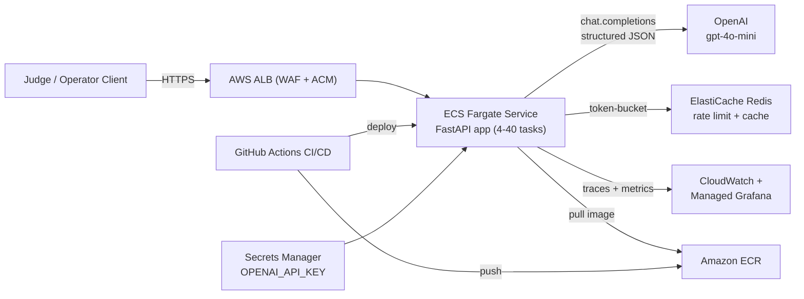
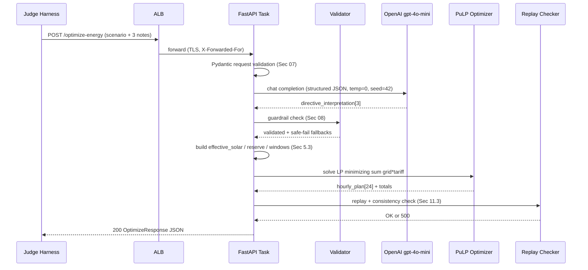
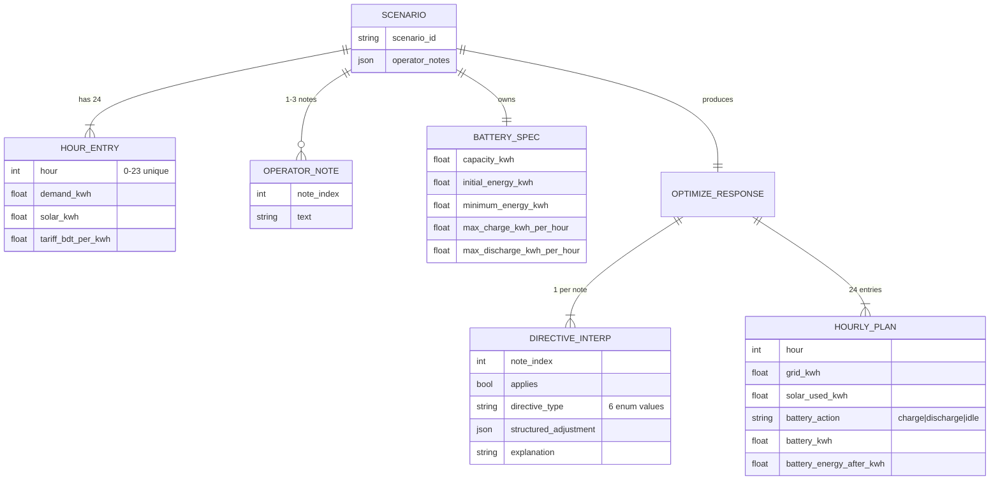

## Plan: GridWise LLM Energy Optimization Service

Build a production-grade HTTP service that ingests a 24-hour energy scenario + 1-3 operator notes, interprets the notes via **OpenAI gpt-4o-mini**, validates them against the PRD's deterministic guardrails, runs a **PuLP** LP optimizer to produce a minimum-cost schedule, and serves the result on AWS ECS Fargate. Sized for **500-5k RPS** peak with autoscaling, observability, and CI/CD from day one.

**Steps**

1. **Scaffold monorepo** — Python project with `pyproject.toml`, `src/app/` (FastAPI service), `src/llm/` (OpenAI client + prompts + JSON-schema validator), `src/optimizer/` (PuLP model + directive applicator), `tests/` (unit + integration + golden cases), `infra/` (Terraform for AWS), `.github/workflows/` (CI/CD). Pin Python 3.12, FastAPI 0.115+, PuLP 2.8+, pydantic 2.x, openai SDK, orjson.
2. **Define Pydantic schemas** — `src/app/models.py`: `HourEntry`, `BatterySpec`, `OptimizeRequest`, `DirectiveInterpretation`, `HourlyPlan`, `OptimizeResponse`. Enforce PRD §07 (24 unique hours 0-23, 1-3 non-empty notes) and §10/§11 response shapes with strict types and `Field(ge=..., le=...)` bounds.
3. **Build LLM interpreter module** — `src/llm/interpreter.py`: single OpenAI chat call per request with structured-output / function-calling returning strict JSON `{note_index, applies, directive_type, structured_adjustment, explanation}`. System prompt enumerates only the six PRD §04 directive types, forbids inventing demand/tariff/solar/battery, mandates ascending unique hours 0-23 and `[start, end)` semantics. Set `temperature=0`, `seed=42`, `response_format={type:"json_schema", json_schema:{...}}`.
4. **Implement deterministic validator** — `src/llm/validator.py`: enforce §08 guardrails — allowed `directive_type`, ascending unique hours, `factor` in `[0,1]`, non-negative finite numerics, reserve ≤ capacity, `structured_adjustment` shape per type, `applies=false` iff `no_op`, `note_index` order 0..N-1 with no duplicates. On any failure return a typed `ValidationError` so the service can fall back to safe defaults (treat malformed note as `no_op`) without crashing — §08 "safe failure".
5. **Build directive applicator** — `src/optimizer/directives.py`: pure functions that take raw `hours` + validated interpretations and produce `effective_solar[h]`, `effective_min_reserve[h]`, `charge_allowed[h]`, `discharge_allowed[h]`, `max_grid[h]` arrays — one source of truth for §5.3 effects used by both the LP and the post-hoc judge replay.
6. **Implement PuLP optimizer** — `src/optimizer/scheduler.py`: 24-hour LP minimizing `Σ grid_kwh[h]·tariff[h]`. Variables: `grid[h]>=0`, `solar_used[h]` in `[0, effective_solar[h]]`, `charge[h]` in `[0, charge_allowed[h]·max_charge]`, `discharge[h]` in `[0, discharge_allowed[h]·max_discharge]`, `E_after[h]` in `[min_eff[h], capacity]`. Constraints: energy balance §9.5, battery transition, hourly rate limits §9.3, end-of-day neutrality `E_after[23]==initial` §9.6, `grid[h]<=max_grid[h]` when directive active. Add solver warm-start from a greedy tariff-arbitrage heuristic for fast convergence under load.
7. **Validator (post-optimization replay)** — `src/app/replay.py`: re-runs §11.3 consistency checks (24 unique hours, finite non-negative values, battery transitions, capacity, min energy, rate limits, solar ≤ effective solar, balance, end-of-day equality, totals match). Fails the request with HTTP 500 if the LP and replay disagree (catches model drift).
8. **FastAPI service** — `src/app/main.py`: `GET /health` returning `{"status":"ok"}` after a 2 s ready check (model + Redis), `POST /optimize-energy` orchestrating interpret → validate → apply → optimize → replay → respond. Per-request timeout 8 s (LLM 3 s, optimizer 3 s, replay 1 s, slack). Structured JSON logging with `request_id`, `scenario_id`, latency breakdown, cost, directive count.
9. **Observability** — `/metrics` Prometheus endpoint; OpenTelemetry traces over the LLM call (genai span attributes), validator, optimizer, replay. Ship to AWS CloudWatch + managed Grafana. Custom metrics: `llm_latency_seconds`, `optimizer_status{optimal/infeasible}`, `directive_validation_failures_total{type}`, `judge_replay_failures_total`.
10. **Resilience layer** — Token-bucket rate limit per IP via Redis (`slowapi` + `redis.asyncio`); LLM retry with exponential backoff (max 2) + circuit breaker (`pybreaker`); fallback path that interprets notes with a rule-based regex parser (sunset/solar, charge/discharge windows, reserve) when OpenAI is down — PRD does not forbid non-LLM fallback as long as LLM is on the primary path. Connection pool sized 200 keep-alive.
11. **Containerize** — Multi-stage `Dockerfile` (slim python:3.12, non-root user, no caches, `--no-cache-dir` install). Image scanned with Trivy in CI. Push to **Amazon ECR** (private, lifecycle policy keeps last 10 tags).
12. **Terraform IaC** — `infra/`: VPC with 2 public + 2 private subnets across 2 AZs, ALB (HTTPS ACM cert, access logs to S3), **ECS Fargate** cluster + service (desired 4, min 4, max 40 tasks, 1024 CPU / 2048 MiB), ECR, Secrets Manager for `OPENAI_API_KEY`, CloudWatch log group (30-day retention), ElastiCache Redis (cache.t4g.small, 1 node for prelim), WAF v2 (rate-based + AWS managed CommonRuleSet), IAM roles via OIDC from GitHub. **Fargate Spot** for 60% of tasks to cut cost; on-demand baseline for SLO.
13. **Autoscaling** — Target-tracking on `ECSServiceAverageCPUUtilization` (70%) and ALB request count per target (1k). Scale-out cooldown 60 s, scale-in 300 s. Provisioned concurrency not needed (stateless). Connection draining 30 s.
14. **CI/CD (GitHub Actions)** — Pipeline: lint (ruff + mypy strict) → unit tests (pytest, >=90% coverage on `validator` and `optimizer`) → golden-case integration tests against the public sample JSON → Trivy scan → docker buildx → push to ECR → ECS rolling deploy (50% / 100%, bake 5 min, automatic rollback on alarm). Protected `main`; PR previews via ephemeral ECS service tagged with PR number for judges.
15. **Load test + SLO gate** — k6 script replaying the public sample + 100 paraphrased notes at 1k RPS for 10 min against a staging cluster; gate release on p99 latency < 2.5 s and zero 5xx. Document SLOs: availability 99.9%, p99 optimize-energy < 3 s, judge replay failures = 0.
16. **Submission + runbook** — `README.md` with quickstart (`docker compose up`), env vars, sample curl. `RUNBOOK.md` with common alerts (LLM 5xx surge, optimizer infeasible, replay mismatch) and rollback procedure. `SUBMISSION.md` listing the public URL, `/health` and `/optimize-energy` examples, and the judge-accessible IAM-scoped credentials.

**Architecture diagram**

**Sequence diagram (one optimize-energy call)**

**Data flow & key entities**

**Relevant files**

- `pyproject.toml` — Python 3.12, deps: `fastapi`, `uvicorn[standard]`, `pydantic`, `pydantic-settings`, `openai`, `pulp`, `orjson`, `redis`, `slowapi`, `pybreaker`, `opentelemetry-*`, `prometheus-client`, `structlog`.
- `src/app/main.py` — FastAPI app, `/health`, `/optimize-energy`, middleware, `/metrics`.
- `src/app/models.py` — Pydantic schemas for §07 request and §10 response.
- `src/llm/interpreter.py` — OpenAI client wrapper, structured-output prompt, retry + circuit breaker.
- `src/llm/validator.py` — §08 guardrails, safe-failure mapping to `no_op`.
- `src/llm/prompts/system.txt` — System prompt enumerating allowed directive types and forbidding invention.
- `src/optimizer/directives.py` — Pure functions: build `effective_solar`, `effective_min_reserve`, `charge_allowed`, `discharge_allowed`, `max_grid` arrays per §5.3.
- `src/optimizer/scheduler.py` — PuLP LP model: variables, constraints (§9.1-§9.6), warm-start greedy heuristic.
- `src/app/replay.py` — Post-optimization replay enforcing §11.3.
- `tests/unit/` — Validator edge cases, optimizer on synthetic 24-h scenarios.
- `tests/integration/` — End-to-end against the public sample JSON; paraphrased-note robustness tests.
- `tests/load/k6_optimize.js` — 1k RPS soak, SLO gate.
- `Dockerfile` — Multi-stage, non-root, slim base.
- `infra/main.tf`, `infra/ecs.tf`, `infra/alb.tf`, `infra/redis.tf`, `infra/iam.tf`, `infra/secrets.tf` — Terraform modules for AWS.
- `.github/workflows/ci.yml` — Lint, test, scan, build, push.
- `.github/workflows/deploy.yml` — Rolling deploy to ECS with automatic rollback on CloudWatch alarm.
- `README.md`, `RUNBOOK.md`, `SUBMISSION.md` — Operator + judge-facing docs.

**Verification**

1. Unit tests cover validator (every §08 rule + paraphrase corpus) and optimizer (energy balance, neutrality, capacity, rate limits, every directive type, infeasible-scenario handling).
2. Integration tests replay the public sample JSON end-to-end and assert response shape, totals, and replay-check pass.
3. Paraphrase robustness suite: >=30 paraphrases per directive type, >=10 distractor notes -> 100% correct interpretation and applied schedule.
4. Load test (k6) at 1k RPS for 10 min: p99 < 2.5 s, 0 5xx, optimizer success >= 99.9%, judge replay failures = 0.
5. Trivy image scan: zero HIGH/CRITICAL CVEs; CI gate.
6. Smoke test post-deploy: `curl /health` -> 200; `curl /optimize-energy` with public sample -> 200 with valid schedule and `total_cost_bdt` matching manual recomputation within 0.01 BDT.
7. DR run: kill OpenAI region in staging -> confirm fallback parser + circuit breaker keep `/optimize-energy` returning 200 with valid `no_op` interpretations; no 5xx.

Next concrete step I can take: scaffold the monorepo skeleton (`pyproject.toml`, `src/app/main.py`, `Dockerfile`, Terraform baseline) so you have a runnable empty service to build on.
